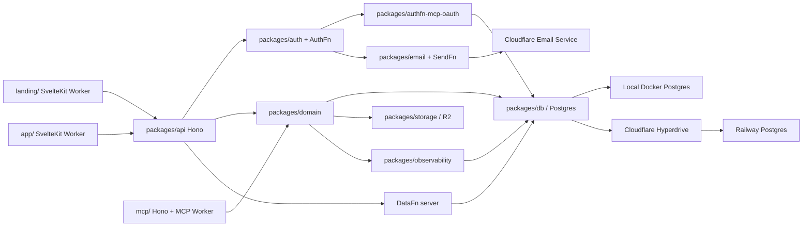

# Execution plan

## Architecture sketch



## Package responsibilities

| Package | Responsibility |
|---|---|
| `packages/config` | Strict environment and binding parsing; no domain logic. |
| `packages/db` | Postgres schema, migrations, transaction helpers, indexes, retention queries. |
| `packages/auth` | AuthFn app/server composition, principal resolution, role/scopes, OTP integration. |
| `packages/authfn-mcp-oauth` | OAuth clients, consent, authorization code, access/refresh tokens, metadata, verification. |
| `packages/email` | SendFn Cloudflare provider composition and Skillplane OTP/invitation renderers. |
| `packages/storage` | Canonical skill bundle validation, deterministic archive, R2 operations, signed download policy. |
| `packages/domain` | Workspaces, skills, versions, contexts, notes, amendments, reviews, policy, idempotency. |
| `packages/api` | Hono endpoints, envelopes, middleware, AuthFn/DataFn mounts. |
| `packages/mcp-schema` | MCP input/output schemas, tools, annotations, error mapping. |
| `packages/observability` | Audit events, redaction, metrics, retention, analytics rollups. |
| `packages/ui` | Tailwind semantic tokens and reusable Svelte components. |
| `packages/testing` | Test-only Postgres/R2/email/OAuth fixtures; excluded from production bundles. |

## Dependency graph

1. `PHASE_00` establishes safe evidence and external dependency state.
2. `PHASE_01` creates the buildable monorepo and local infrastructure.
3. `PHASE_02` establishes database, Hono, AuthFn/DataFn composition, and shared envelopes.
4. `PHASE_03` completes real email OTP and session behavior.
5. `PHASE_04` depends on AuthFn and database tenancy primitives.
6. `PHASE_05` depends on database and R2 bindings.
7. `PHASE_06` depends on authentication and shared API contracts.
8. `PHASE_07` depends on tenancy, skill domain, and design system.
9. `PHASE_08` depends on skill detail and domain versioning.
10. `PHASE_09` depends on skills, contexts, roles, and learning metadata.
11. `PHASE_10` depends on AuthFn sessions, database, and consent UI primitives.
12. `PHASE_11` depends on OAuth verification, search, versions, R2 retrieval, and audit.
13. `PHASE_12` depends on amendments, contexts, idempotency, and MCP read infrastructure.
14. `PHASE_13` depends on all audited app and MCP paths.
15. `PHASE_14` depends on public visibility, search, and completed product claims.
16. `PHASE_15` hardens the complete local product.
17. `PHASE_16` requires the user-supplied Hyperdrive ID and provisioned production bindings.
18. `PHASE_17` performs full acceptance and evidence closure.

## Phases overview

| Phase | Goal | Delivered capability | Verification |
|---|---|---|---|
| 00 | Establish a safe implementation baseline | Conduct evidence, dependency inventory, worktree protection, executable environment contract | Conduct and external-worktree preflight |
| 01 | Create the real monorepo and local infrastructure | Buildable SvelteKit/Hono workspaces, Docker Postgres, local R2 | Root build, Postgres health, binding tests |
| 02 | Establish data and HTTP foundations | Postgres migrations, DataFn schema/server/client, Hono envelopes and middleware | Migration, authorization, Hono integration tests |
| 03 | Complete authentication and email | AuthFn OTP/session flow and Cloudflare SendFn adapter | OTP integration, provider contract, CSRF/rate-limit tests |
| 04 | Implement tenancy and credentials | Personal/org workspaces, roles, invitations, service principals | RBAC and invitation integration tests |
| 05 | Implement skill storage and immutable version core | Bundle validator, R2 storage, skill/version services, search | Determinism, concurrency, R2/Postgres failure tests |
| 06 | Build design system and authenticated shell | Linear-inspired UI primitives, themes, auth and workspace shell | Component, accessibility, screenshot checks |
| 07 | Build skill management UI | Skills list/create/detail/content/version/diff/settings | E2E create/publish/archive/reload |
| 08 | Build contexts and shared notes | Context/knowledge/note services and UI with revisions | Concurrency and persistence E2E |
| 09 | Build amendments and review | Learning metadata, candidates, policies, approval/rejection/auto-publish | Domain, policy, diff, review E2E |
| 10 | Implement MCP OAuth authorization server | AuthFn plugin, metadata, PKCE, consent, tokens, service grants | OAuth conformance and attack suite |
| 11 | Implement MCP read surface | Search, retrieve, assets, versions, context reads | MCP protocol, authorization, audit, R2 tests |
| 12 | Implement MCP mutation surface | Skill amend and context note writes | Idempotency, conflicts, policy, MCP E2E |
| 13 | Implement audit and analytics | Retention, rollups, dashboards, audit explorer/export | Idempotent rollups, retention, redaction, UI E2E |
| 14 | Complete landing and public discovery | Marketing site, public skill pages, SEO, public search | Crawl, content-contract, accessibility, visual evidence |
| 15 | Production hardening | Security, performance, accessibility, reliability, recovery | Full attack matrix, load gates, accessibility matrix |
| 16 | Deploy Cloudflare and Railway production | Migrations, Hyperdrive, R2, Email, Workers, domains, rollback | Production smoke and restore rehearsal |
| 17 | Final acceptance | Full requirements/test audit and operational handoff | All root gates and manual critical-path verification |

## Cross-phase engineering rules

1. Each phase MUST begin by reading `.conduct/ledger.md`, its phase file, and the latest relevant engineering logs.
2. Each phase MUST use test-first or test-concurrent implementation for domain invariants.
3. Each phase MUST preserve unrelated work and MUST not modify external worktrees unless the phase explicitly permits it.
4. Every Superfunctions edit MUST follow the pre/post log contract.
5. No phase may add a temporary production fallback to make tests pass.
6. Every database mutation path MUST be exercised against Postgres.
7. Every UI mutation E2E MUST assert immediate state and state after reload.
8. Every UI phase MUST capture screenshots named by route, state, viewport, and theme.
9. Each phase MUST write `.conduct/specs/2026-07-25-new-17dd6c3e-spec/phase-reports/PHASE_XX.md`.
10. After each phase, append the spec and global `logs.csv` with command `execute`, agent/model/launcher metadata, phase number, and spec path.

## Global verification commands

The implemented repository MUST provide these root commands:

```bash
pnpm install --frozen-lockfile
pnpm conduct:verify
pnpm format:check
pnpm lint
pnpm typecheck
pnpm test:unit
pnpm test:integration
pnpm test:security
pnpm test:a11y
pnpm test:e2e
pnpm build
pnpm deploy:check
```

Commands MUST be non-interactive and return non-zero on failure.

## Definition of Done

No phase is complete unless its verification steps pass.

The project is complete only when:

- every requirement is implemented;
- every positive and negative test vector is automated or explicitly and reproducibly observed;
- local fresh-start and persisted-restart workflows pass;
- production Cloudflare deployment succeeds with Railway through Hyperdrive;
- email OTP is delivered through Cloudflare Email Service;
- MCP OAuth and all read/write tools pass conformance and security tests;
- audit and analytics are visible and correctly retained;
- accessibility, security, performance, backup, restore, and rollback gates pass;
- all `.conduct` evidence and the final intent audit are current;
- the tracker entry is updated only by the final execution phase with its completion report.
